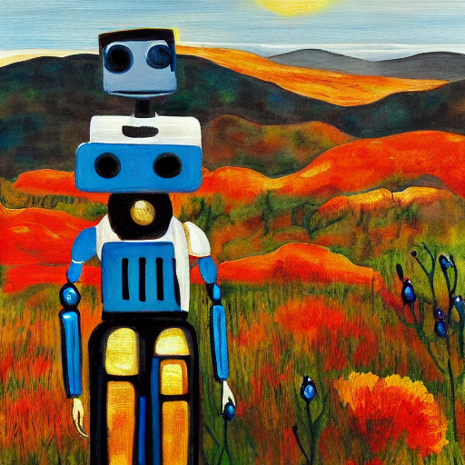

The Generative Landscape
================

<!-- WARNING: THIS FILE WAS AUTOGENERATED! DO NOT EDIT! -->

Work has just started on this - for now, if you’re interested in these
topics you might want to check out the previous course I ran on AI ART:
[AIAIART](https://github.com/johnowhitaker/aiaiart)

If you want to be notified when the course goes ‘live’ you can sign up
for an email at <http://thegenerativelandscape.com/>

The material will show in github pages at
<https://johnowhitaker.github.io/genai/> (and the
http://thegenerativelandscape.com will redirect there once we launch).
Hooray for the magic of nbdev.

## Curriculum plan / TODO

### Topics:

- Intro: The Generative Landscape
- PyTorch, AutoGrad and Gradient Descent
- Constructing ANNs, Loss Functions
- Representations: What do ANNs Learn? Style Transfer
- CLIP/CLOOB: Multiple Modalities in a Shared Latent Space. Use as a
  loss function
- Generative modelling: Noise -\> Data (Auto-Encoders and VAEs)
- GANs 1 - GAN training, a simple DC-GAN
- GANs 2 - Conditioning, Improvements, Modern GANs, CLIP guidance
- Sequence Modelling 1 - Ideas, RNNs, Language Models as Representation
  Learners
- Sequence Modelling 2 - Transformers
- Sequence Modelling 3 - Everything is a sequence (VIT, VQGANs,
  Dalle-mini, Parti, flamingo, music generation, other applications)
- Diffusion Models 1 - A New Type of Generative Model
- Diffusion Models 2 - Conditioning, Guiding, Improvements
- Diffusion Models 3 - The Current DM Landscape, Using Diffusion Models
  Creatively (inpainting, guiding, animation)
- Spotlight: Audio
- Spotlight: Video

### Extra Skills / Bonus Material:

- **Ethics in generative modelling**
- Fine-tuning existing models
- Working with GPUs
- Multi-GPU or TPU training
- Experiment Tracking (eg W&B)
- Sharing demos w/ Gradio
- Managing cloud machines
- Datasets and Dataloaders Intro (also defines data util funcs for the
  rest of the course)
- Dataloaders deep dive, streaming data
- Navigating other codebases
- Version control and CI (+ NBDev)
- “Text inversion” (https://arxiv.org/pdf/2208.01618.pdf)
- “prompt to prompt editing” https://arxiv.org/pdf/2208.01626.pdf
- Lots of paper readings / sumaries

### Projects:

- Train a GAN, explore hyperparameters
- Fine-tune a diffusion model on a custom dataset
- Create and share a final project, including a report and demo

Guest discussions: as many as we can :)

Paper explainers: as many as we can :)
